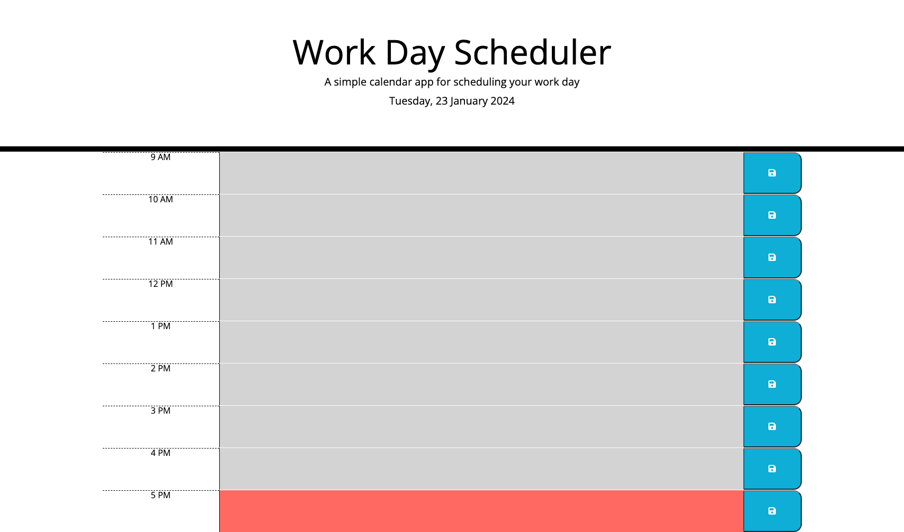
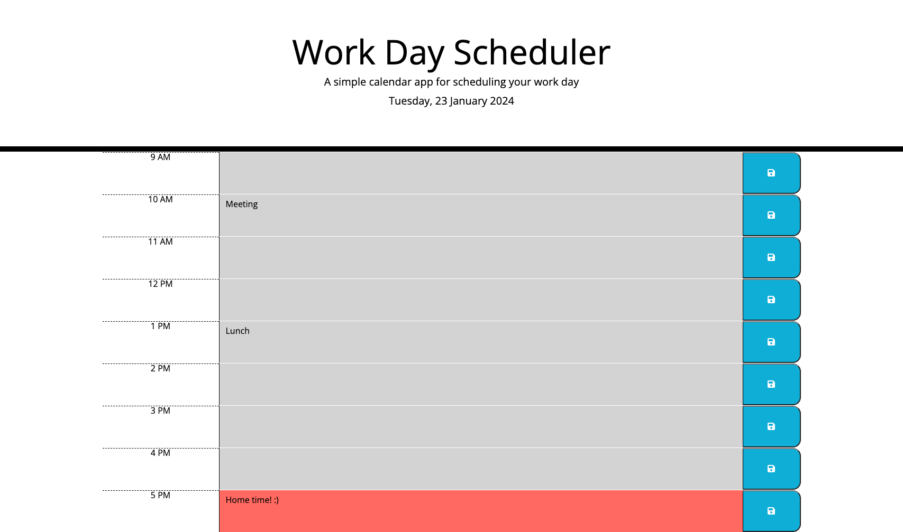

# Work Day Scheduler

A simple calendar that allows a user to save events for the working day.

The criteria for this is as follows:

- Display the current day at the top of the calender when a user opens the planner.
- Present time blocks for standard business hours when the user scrolls down.
- Color-code each time block based on past, present, and future when the time block is viewed.
- Allow a user to enter an event when they click a time block
- Save the event in local storage when the save button is clicked in that time block.
- Persist events between refreshes of a page

#Useage

The website can be accessed [here](philc7.github.io/work-day-scheduler/).

To use the scheduler:

- You must click onto a text area for the required hour.
- Enter your text, then click the save button to the right.
- Your data will be saved to your local storage until deleted.

### This is how the page should look.

#### Before any input is given.

#### After saving your input.

# Credits

### Here are a few references that helped me to further understand localStorage, sort() method and how to add audio to the game.

#### Websites

[Day.js](https://day.js.org/en/)
[MDN](https://developer.mozilla.org/en-US/)
[Local Storage](https://blog.logrocket.com/localstorage-javascript-complete-guide/)

# License

Please refer to the LICENSE in the repo.
